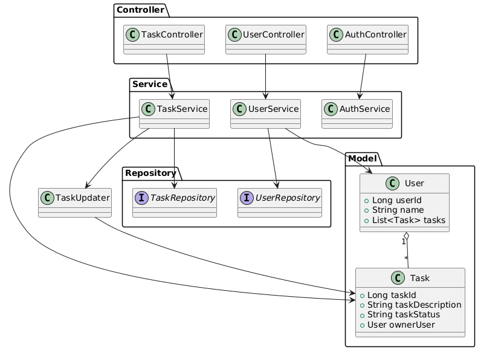

# Sistema de Gerenciamento de Tarefas

## 1. Visão Geral

O projeto consiste em um sistema de gerenciamento de tarefas que permite aos usuários:

- Cadastrar, atualizar, visualizar e listar tarefas com controle de status.
- Realizar autenticação e autorização de usuários.

### Principais funcionalidades:

- Cadastro e autenticação de usuários.
- Criação, atualização e listagem de tarefas.
- Acompanhamento de status de cada tarefa.

---

## 2. Decisões Arquiteturais

### Arquitetura

O projeto adota a arquitetura **MVC** com camadas separadas, dividindo responsabilidades em:

- **Model (Entidades)**: Representação de dados.
- **Controller**: Endpoints REST para interação com o sistema.
- **Service**: Regras de negócio e orquestração da lógica.
- **Repository**: Persistência com Spring Data JPA.

### Principais tecnologias e bibliotecas:

- **Spring Boot**: Estrutura base da aplicação.
- **Spring Data JPA**: Abstração para operações com banco de dados.
- **Lombok**: Redução de código boilerplate em entidades e DTOs.
- **Mockito + JUnit**: Testes automatizados com simulação de dependências.
- **JWT**: autenticação
---

## 3. Modelagem de Dados

O sistema possui duas entidades principais:

### Entidade `User`

- `userId`
- `name`
- `tasks`: lista de tarefas associadas

### Entidade `Task`

- `taskId`
- `taskDescription`
- `taskStatus`
- `ownerUser`: referência ao usuário dono da tarefa

---

## 4. Endpoints

### Usuários

- `GET /users/{userId}`  
  Retorna os dados do usuário com o ID especificado.

- `POST /users`  
  Cria um novo usuário com os dados fornecidos no corpo da requisição.

- `PUT /users/{id}`  
  Atualiza os dados do usuário com o ID especificado.

- `DELETE /users/{id}`  
  Remove o usuário com o ID informado do sistema.

- `GET /users/account`  
  Retorna a conta do usuário "admin" (parece ser algo estático ou provisório, útil para testes ou lógica interna).

### Tarefas

- `GET /tasks/{id}`  
  Retorna os dados de uma tarefa específica, usando o ID da tarefa.

- `GET /tasks?userId={userId}`  
  Lista todas as tarefas associadas ao usuário com o ID fornecido.

- `POST /tasks`  
  Cria uma nova tarefa com os dados enviados no corpo da requisição.

- `PUT /tasks/{id}`  
  Atualiza os dados de uma tarefa existente, identificada pelo ID.

###  Autenticação

- `POST /auth/login`  
  Autentica um usuário com nome e senha.  
  
---

## 5. Testes Automatizados

### Estratégia

- Utilizamos **Mockito** para simular dependências em testes de unidade, especialmente nos serviços e controladores.
- Os testes isolam a lógica de negócio das interações com banco de dados e autenticação.

---

## 6. Class diagram 

